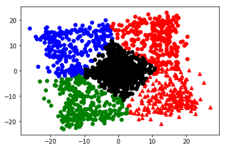

# AE-PCA-Kmaens(python)
>Signal Feature Extraction and Autoencoder-Principal Component Analysis-Kmeans clustering based on Python.

## Contribution
[1] Provides a common extraction method for time domain features of signals.

[2] A simple implementation of AE-PCA-Kmeans.

---
### Applications

Time domain signal clustering

 

---
### **Warning**
The program notes are in non-English and contain some of Spyder's operating tips.

------
Author: Green_yuan

This program is free software: you can redistribute it and/or modify
it under the terms of the GNU General Public License as
published by the Free Software Foundation, either version 3 of the
License, or (at your option) any later version.
